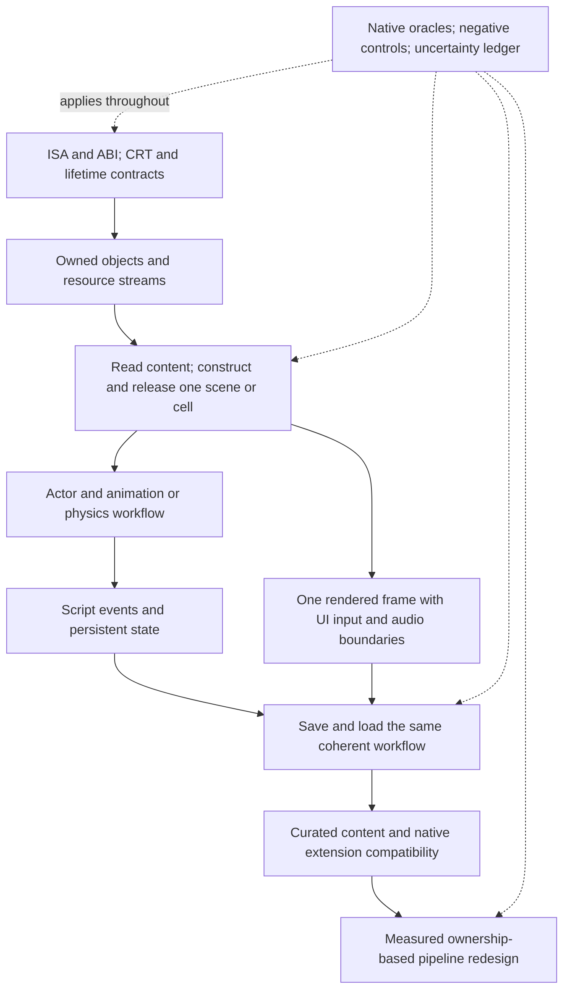

# Full engine translation and behavior map

The direction is viable to investigate: broad recovered coverage would give us
more control over fixes, QA and scheduling. This map makes the full target
visible without interpreting a successful small slice as a completed subsystem.
It maps **38 coverage domains**, all **176001 discovered function records**,
their actual Ghidra body ranges, every pinned static import and the entire PE
section envelope. Most function ownership and transitive state effects are
still unknown. That uncertainty is an explicit work item.

The governing requirements are in [engine-coverage-spec.md](engine-coverage-spec.md).
This is a mapping/planning deliverable. It does not begin full-engine implementation
or change game behavior, saves, installed mods or scheduling.

## Read the map at three levels

- [Structural snapshot](engine-coverage-snapshot.md): measured inventory and
  gaps across the pinned executable, imports, calls, code and data.
- [Measured sizes](engine-sizes.md): total inventory and partial group/domain
  function and body-byte attribution, with unknowns and overlaps reconciled.
- [Expected effort](engine-effort.md): a provisional allowance for the next
  bounded workflow, full-scope uncertainty and a route to measured estimates.
- [Subsystem catalogue](engine-module-catalogue.md): each domain's treatment,
  dependencies, existing evidence, next QA gate, state/lifetime audit and
  parallelism prerequisites. [CSV](engine-modules.csv) supports spreadsheet
  filtering; [JSON](engine-modules.json) is its authoritative authored source.
- [Parallel pipeline design constraints](parallel-pipelines.md): what must be
  established before changing concurrency or engine behavior.

The detailed address-level function, body-range, call, import, RTTI, unwind and
gap ledgers are kept privately in `local/analysis/coverage/`. They contain
metadata, not copied instruction bodies; they remain excluded from public Git
alongside other detailed game-derived analysis.

## What “everything” includes

| Coverage group | Domain IDs | Work to account for |
|---|---|---|
| Foundations | F01-F07 | ISA/ABI; startup/shutdown; CRT/EH/RTTI/TLS; allocation/lifetime; containers/strings/math; jobs/synchronization/time/RNG; object/handle/vtable model |
| Content | C01-C03 | Loose/archive/VFS streams; plugin records/FormIDs/load order; asset decoding and caches |
| World | W01-W03 | Cells/references/streaming/LOD; terrain/vegetation/water; weather/climate/world time |
| Simulation | S01-S09 | Actors/movement/values; AI/navigation/perception; combat/magic; inventory/equipment/progression; quests/dialogue/factions/crime; animation; physics; Papyrus; event/condition/console dispatch |
| Presentation | P01-P07 | Scene graph/cameras; renderer preparation; GPU/shaders/presentation; UI/Scaleform; audio/lip sync; input/window controls; video |
| Persistence | D01 | Save/load, versioning, graph/handle restoration, script state and extension co-saves |
| Platform | X01-X02 | Windows/runtime/native library contracts; Steam and online/Creations features |
| Compatibility | M01-M03 | Data/script/asset/UI mods; SKSE/native DLLs/patches; renderer injectors and incorporated engine-fix behavior |
| External tools and QA | T01-T02 | Creation Kit/compiler/launcher output contracts; repeatable QA/build/diagnostic evidence |
| Unresolved discoveries | U00 | Every unassigned code/data region, unknown call target, missing signature, state effect and dynamically discovered dependency |

These rows are a complete planning taxonomy for the known project envelope.
They are not an assertion that every individual game feature is already
identified. For example, a newly discovered runtime facility must receive an
owner, dependency/effects audit and acceptance criteria under a domain or extend
the catalogue; it cannot be silently discarded as uncommon.

The static ledger currently leaves **175459 function records without a proposed
subsystem owner**. Ghidra reports 69277 nondefault names, but a name supplied by
Function ID is not trustworthy ownership/signature proof. Community labels give
701 candidate rows at 698 unique addresses, with aliases preserved. Even those
are hypotheses; their addresses/byte-boundary evidence do not recover behavior.
The small tested entries have stronger evidence within their exact harness scope.

## Implementation treatment is explicit

Every executable dependency needs one of these dispositions, with reasons and
verification. A disposition is not a successful implementation result.

| Treatment | Meaning | Completion evidence |
|---|---|---|
| Translate | Recreate the engine or embedded-library instruction behavior in generated code | Complete code/data/call closure, supported semantics, exact native oracle and integrated workflow |
| Retain a native bridge | Call an existing OS/runtime/driver/library through an explicit ABI and lifecycle contract | Real boundary exercised, including callbacks, errors, ownership and teardown; supported platform/version recorded |
| Behavioral reimplementation | Replace an engine or middleware contract intentionally | Specified observable contract, original compatibility corpus, changed-behavior tests and integration proof |
| Preserve content | Keep game/plugin/script/UI/shader/media files as inputs | Format readers/runtime behavior, dependency and override semantics validated; content is not mistaken for CPU machine code |
| Keep external tooling | Continue using separate authoring/compiler/launcher tools where appropriate | Required outputs and workflows remain compatible; an actual runtime dependency is reclassified if found |
| Investigate unknown | No justified treatment/owner exists yet | Evidence resolves the unknown; unexecuted or unnamed code is not considered safely removable |

“All engine behavior covered” does not require translating Windows or GPU
drivers. It does require accounting for every call and the assumptions of any
retained dependency. Havok/Scaleform code embedded in the executable belongs to
the engine coverage envelope. Bink/Steam/OS/runtime DLL boundaries remain real
work even when their external implementations are retained. Runtime discovery
must include dynamic loading, COM-created interfaces, vtables and callbacks;
the static import list alone cannot close the dependency graph.

Papyrus PEX, UI ActionScript/SWF, shader bytecode, model/animation data, plugin
records, audio/video and saves need their appropriate reader/runtime or explicit
conversion strategy. They are not all x64-to-C translation tasks. The installed
Data directory currently has 93 BSA archives, 15 ESM files and 65 ESL files; this
top-level observation does not inventory archive contents or the complete MO2
virtual filesystem. Those remain content-discovery tasks.

## Binary envelope and genuine gaps

Every declared section, image alignment region, raw file gap/overlay and PE
directory is ledgered. Relevant obligations include:

- Executable `.text`: discover/validate leaf routines, thunks, shared tails,
  branch tables, exception funclets, callbacks, indirect jumps and embedded data.
  A .pdata record may describe only a shrink-wrapped fragment, as CRC proved.
- `.bind` and the real entry boundary: startup remains unproven. No protection
  unpacking was performed; an owned replacement lifecycle still requires all
  initialization dependencies to be recovered and validated.
- Read-only data: vtables, RTTI, constants, strings, registries, formats, handler
  metadata and pointer relocations. Translating function bodies alone omits them.
- Writable `.data`: initialized values plus **22011528 virtual zero-fill bytes**.
  Initialized object graphs, caches, registries, locks and ownership emerge at
  runtime; they are not present in the disk bytes.
- `.pdata` and handler metadata: 122258 runtime records, 28488 chained records,
  cleanup/catch state, native/generated frame transitions and preserved state.
  The currently verified cleanup is one real scope, not general EH conformance.
- TLS, load configuration, imports/IAT/delay imports, relocations, resources,
  exports and header/security fields: each present/absent directory is recorded.
  Security cookies and CFG/dispatch policy need an explicit replacement/runtime
  treatment when reachable; metadata does not port itself to new host frames.
- Gaps outside analyzer bodies: **2289993 executable-section bytes** require
  classification. Some may be padding or data, others missed/protected code.
  This is neither an untranslated-code count nor a progress percentage.

The call index contains 413759 direct-target rows, 16019 computed external-label
rows, 4017 computed numeric-target rows and 81733 computed rows without a target.
These are metadata observations. Multiple targets may share a call site. One
recovered dispatch contract can resolve many sites, while a named external
function can still hide a difficult ABI/ownership boundary. No per-call manual
effort estimate is inferred.

## Track proof in separate dimensions

For each function/cluster and its dependency closure, retain independently:

| Dimension | Required evidence |
|---|---|
| Discovery | Real extents/overlaps, code versus data, incoming references, possible entry/indirect targets and uncertainty |
| Ownership and types | Name provenance, calling convention, argument/return layouts, object identity and field evidence |
| Translation | Generated-body identity, complete opcode support and declared dependencies; successful compilation alone is insufficient |
| Native equivalence | Exact state/memory/FP/events/cleanup in valid fixtures, boundary coverage and an effective negative control |
| Integrated behavior | A real connected workflow with initialized objects, resource lifetime, failures and teardown |
| Compatibility and QA | Saves, scripts, content/mod cases, visual/audio results, long runs, regression corpus and supported versions |
| Intentional change | Written changed-behavior contract, preserved unaffected behavior, failure reproduction and new expected results |
| Parallel execution | Transitive effects, ownership/affinity, dependency ordering, reclamation, deterministic commit and measured end-to-end performance |

Do not compress these into a single “translated” checkbox. The existing 13
selected function entries participate in bounded passing harnesses; **zero full
subsystems have been verified**. Their lessons transfer, but their proof does
not automatically transfer to the rest of a class or module.

## A dependency-respecting route through the full map

This is a future sequencing recommendation, not an implementation plan already
in progress. The catalogue has cross-system dependencies and integration cycles;
it is not suitable for blindly processing one whole module after another.
Keep each actual implementation stage a narrow connected workflow.

First connect allocation/object lifetime to a real resource/scene path. Then
broaden that path through actual state, script and persistence behavior rather
than translating disconnected easy helpers indefinitely. Renderer/simulation
integration will require bounded contracts between mutually dependent domains;
a whole renderer does not have to be finished before one frame can be tested.

Complexity should be measured by closed workflows and resolved dependency
families: how often existing semantic repairs carry over, how many new native
contracts/ownership rules appear, and how much integration/QA is needed per
workflow. Function counts, generated code volume and raw analysis throughput
cannot produce a reliable calendar estimate. This map supplies a scope baseline
that can later support evidence-based estimates.

## Compatibility and modernization decisions

Covering all original code would make inspection and modification much easier,
but low-level lifted CPU-state code is not automatically a maintainable typed
engine architecture. Keep generated recovery, explicit ABI/layout contracts and
authored behavior changes distinguishable. Typed cleanup and simplification
should follow evidence and regression tests, with the original oracle retained.

Arbitrary native DLL compatibility and broad object-layout/scheduling changes
can conflict. Plugins may patch exact addresses/instructions, retain raw engine
pointers, assume a vtable/layout, or expect a callback on a specific thread.
The [SKSE distribution](https://skse.silverlock.org/) itself publishes separate
runtime-specific builds; supporting one does not prove others work. Each plugin
needs a disposition: supported original boundary, source port, behavior absorbed
and tested, or explicitly unsupported. An address-translation table cannot by
itself preserve assumptions about object lifetimes or thread ordering.

There is also no reason to preserve an original serialization bottleneck merely
because the oracle had one. We first need a coherent state-capture contract and
save compatibility tests; background serialization can then be a deliberate
implementation choice. Similar reasoning applies to resource decoding, scene
preparation, animation and rendering. See [parallel pipelines](parallel-pipelines.md).

## Reproducing the historical inventory

This is the 2026-10-08 mapping snapshot. Detailed mapping inputs and the Ghidra
project are retained in the owner's private recovery snapshot; the public
reports preserve the aggregate inventory, taxonomy and uncertainty. This
mapping is not an additional gate executed by `research.py`.

## Mapping verification and lessons

The independent verifier reconciled all 176001 discovered function entries,
177137 body ranges, 122258 runtime-function records, 606 imports and 515528
call-index rows with their source metadata. The PE image and on-disk file
partitions balance; each executable-section byte is represented by an analyzer
body or an explicit unclassified gap. Source and artifact hashes are retained in
`local/analysis/coverage/mapping-manifest.json`; the inspected verification report
is `local/analysis/coverage/mapping-verification.json`.

| Mapping requirement | Evidence and boundary |
|---|---|
| M1: structural envelope | Complete ledger of the current discovered records and declared PE regions, including gaps; semantic discovery remains open |
| M2: subsystem catalogue | 38 domains with dispositions, dependencies, present evidence, next gates, ownership and parallelism prerequisites |
| M3: treatment distinctions | Engine translation, native bridges, behavioral replacement, content and external tools have separate obligations |
| M4: proof dimensions | Names and byte coverage remain hypotheses; bounded slice proof is separate from integration and changed-behavior proof |
| M5: route and concurrency | Narrow integrated workflows, state/lifetime contracts, ordered commits, save barriers and plugin constraints documented |
| M6: reproducibility | Read-only metadata exporter, hashed builder outputs and independent reconciliation retained alongside authored reports |
| M7: sizes and effort | Partial group/domain counts and body-byte unions reconcile to the existing ledger; full group sizes remain unestimated; effort assumptions and calibration requirements documented separately |

Two analysis pitfalls affected the mapping. Several community names share one
address: storing only one label per address silently drops aliases and may change
a proposed owner. The ledger now preserves every label and treats conflicting
proposals as unknown. Also, the PE has two sections named `.text`; one is writable
and non-executable. Section identity now includes its index and actual permission
flags rather than inferring its treatment from a name.

Function body ranges, runtime-function extents and executable section sizes are
different quantities. Disconnected bodies, shared fragments, padding, embedded
data and startup regions prevent treating any one as a denominator for engine
completion. Later slices must retain these distinctions and extend the unknown
ledger as new targets and state effects are found.

The mapping requirements are satisfied. The unknowns described here are the
subject of subsequent engine research, not completed engine functionality or
unmet requirements concealed by the mapping's completion.

Relevant structural references are the pinned local CommonLibSSE headers and
wrappers, including MemoryManager, BSResourceNiBinaryStream, TESDataHandler,
BGSSaveLoadManager, BSScript/SkyrimVM, GFx and Havok families. The
[upstream class index](https://po3.commonlib.dev/classes.html) is useful for
navigation; SDK wrappers that call engine relocations are not recovered engine
implementations or proof of current-version layouts.
