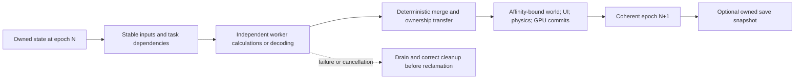

# Changes to behavior and parallel pipelines

Full behavioral coverage would increase our ability to fix and audit the engine.
Safe concurrency additionally requires a map of **who owns state, who may read or
write it, when it is valid, and which order is externally observable**. Current
tests do not provide that map for the whole engine. They prove one controlled
initialization scenario, not general concurrent camera/cache access.

## The admission record for a candidate workflow

Before moving a connected workflow to workers, record:

| Contract | Questions that must have evidence |
|---|---|
| Reads and writes | Which objects/globals/caches are touched transitively through calls, native helpers and callbacks? Which apparent reads lazily initialize or update caches? |
| Ownership and lifetime | Who allocates, publishes, invalidates and destroys each object? Can a pointer escape? Can an unload/exception/callback destroy an object while work is outstanding? |
| Thread affinity | Which engine, physics, UI, graphics, OS, VM and plugin calls require a particular owner/context/thread? What TLS/FP/runtime state does a worker need? |
| Dependencies | Which tasks consume which versions of state? Where must writes become visible? What are lock order, completion and reentrancy rules? |
| Determinism | Which event, RNG, floating-point reduction, iteration and merge order affect simulation, scripts, saves or mods? What intentional nondeterminism is allowed? |
| Failure and shutdown | How do cancellation, partial construction, exceptions, resource eviction, scene unload and shutdown drain work and reclaim state? |
| Persistence | What coherent world/VM version is saved? How are background tasks and callbacks quiesced or captured without a torn state? |
| Performance | Where is the measured bottleneck? Do scheduling, copies, synchronization, memory bandwidth, GPU stalls or native bridges erase the intended gain? |

Static call/body metadata can suggest contracts and identify missing edges. It
cannot prove dynamic aliasing, complete indirect targets or safe ownership. We
will need traces, focused native fixtures, controlled adversarial schedules,
lifetime instrumentation and eventually real connected runtime tests.

## Candidate pipeline shapes

These are design hypotheses to test, not capabilities implemented by this map.

| Workflow | Candidate worker work | Required owned publication point | Main risks |
|---|---|---|---|
| Resource streaming | Independent reads, decompression and decoding | Register completed resources and attach them to an owned scene/cell | Duplicate requests, eviction/unload, cache mutation, GPU lifetime |
| Plugin/content loading | Parse independent buffers/records | Deterministic master/FormID linking and override publication | Load-order semantics, shared registries, references and error unwind |
| Scene preparation | Transform/bounds/cull work over a stable graph snapshot | Commit one frame's consistent visibility/render inputs | Dirty caches, graph mutation, camera/frame state and node destruction |
| Animation | Per-instance pose/graph calculation with separate outputs | Apply root motion, events, physics links and final pose in defined order | Shared graph state, callbacks, actor lifetime and event ordering |
| AI and simulation queries | Read-only perception, path queries and pure calculations | Ordered world mutations and cross-actor effect commits | Mutable world/physics access, RNG streams and order-dependent gameplay |
| Render preparation | Independent draw-list/material preparation; possibly command recording | Defined pass execution and presentation ownership | Transparency ordering, resource updates, GPU context affinity and injectors |
| Save processing | Encode/compress/write an already coherent snapshot | Atomic publication of the complete save and related co-save state | Torn world/VM state, pointer fixups, extension serializers and failure cleanup |

Direct3D 11 allows concurrent device use, but a device context may be used by
only one thread at a time; immediate-context and DXGI presentation use also need
coordination. Separate deferred contexts can be considered for recording, but
driver support and workload determine performance. These API contracts alone
do not make the engine's scene/material/resource code safe for workers.
[Microsoft threading documentation](https://learn.microsoft.com/en-us/windows/win32/direct3d11/overviews-direct3d-11-render-multi-thread-intro).

The diagram describes a possible contract, not a requirement to force every
system into one global frame barrier. Existing independent pipelines may remain
independent if their own state/lifetime and interaction contracts are proven.
Recover existing workers and middleware scheduling before claiming that work
was previously impossible or wholly serialized.

## Separate equivalence from intentional fixes

Keep two kinds of evidence:

1. **Recovery equivalence:** unchanged recovered behavior matches the original
   instructions, including observable edge cases, order, errors and cleanup.
2. **Changed behavior:** a documented fix or scheduling change has explicit new
   expected results, a reproducible original defect/limitation, and regression
   evidence that unaffected contracts remain compatible.

A candidate that reproduces an original bug is not a verified fix. A candidate
that differs from native behavior is not automatically incorrect once that exact
change is specified and verified. Do not loosen comparisons or turn old failures
into passes to conceal an unexplained difference. Retain baseline evidence and
the reason each intentional difference is accepted.

## Plugin behavior and thread compatibility

Native plugins may hook arbitrary instruction sites and access internal engine
objects without a stable ownership contract. They can also call back into the
engine during a native/generated transition. Translating the executable does not
recover those plugins' contracts. Source-porting or incorporating a fix may let
us replace fragile hooks with supported behavior, but each fix needs provenance,
intended semantics and its own regression corpus. Proprietary or unavailable
plugin source remains an explicit dependency/compatibility investigation.

For each supported plugin or incorporated behavior, track exact runtime/version,
patched locations, original behavior replaced, new state, pointer/layout access,
callback affinity, reentrancy, asynchronous work, teardown and serialization.
Do not promise arbitrary unchanged binary-plugin compatibility alongside a
reorganized object model and new scheduling model without demonstrating it.

## What would justify proceeding with a scheduling change

Select one measured bottleneck and a bounded ownership-safe workflow. Establish
baseline behavior/performance; implement the smallest necessary ownership and
dependency change; verify outputs, ordering, teardown and adversarial schedules;
then measure end-to-end latency/throughput under representative load. Increasing
worker count or moving a loop off-thread is not completion evidence.

Broad translation remains useful because it exposes more of the dependency and
state surface to review. The durable improvement comes from explicit contracts,
reproducible QA and measured changes, rather than assuming readable recovered
code is already suitable for concurrent execution.
